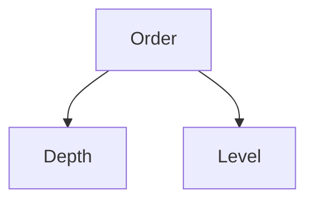

> # **```Module 17: Binary Tree Implementation```**

A tree or **N-ary tree** is a non-linear hierarchical data structure combination of nodes.

- A tree is a non-linear data structure.
- Tree data structure is a hierarchy structure.
- File system is a prominent example of tree data structure.
- Topmost level of a tree is consist of single node namely **root** node.
- Apart from the leaf nodes, all other nodes in a tree can be addressed as parent node to it's next level nodes connected to it.
- Nodes belongs to the last level of a tree is said to be **leaf** node. These leaf nodes can't have any child nodes, thus leaf nodes can't be parent.

## **```Binary tree```**

A generic tree or **N-ary tree** can have as many nodes as children, but in binary tree a node restricted to have atmost 2 childrens.

- Binary tree is used in machine learning algorithm as decision tree.
- To visualize binary search
- Compiler syntax tree implemented
- Heap sort

<ins>Traverse and print **Binary Tree**</ins>

Unlike linear data structures, the non-linear data structures can't be print in linear order fashion since it has multiple path to be traversed.

To traverse a binary tree there are specific way or order, such as:

1. In order traversing
2. Pre order traversing
3. Post order traversing


