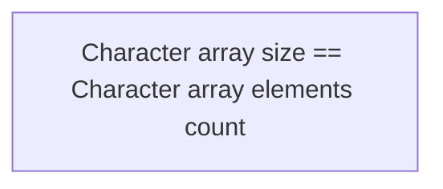

> # ```Module 10```

## <p align="center"><b>String</b></p>

An array of characters or sequence of characters (Single entity ASCII characters [32-127] in case of C and C++, modern languages support UNICODE) are said to be **string**.

Character arrays are different from integer or other types of arrays. Character represents a single unique entity. whereas numbers can contain multiple digits. So, in other types of arrays (like an integer array), it is important to make sure multiple elements are separated by spaces. But in the case of a character array, a space itself is a character, so character arrays don't require space to seperate between elements.

In the case of a character array, each element is distinct, so we don't need any sort of seperator for character arrays or strings. Whereas, an integer array element could have multiple digits. Here, we require something to separate multiple elements. For example, if 111 is an array element and 222 is another array element, if we don't put any space between 111 and 222, this will become 111222, which is also a single number. So, we require a space separator for only number type or non-character type of array.


