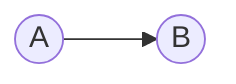
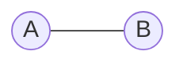

> # **```Graph```**

Graph is a non-linear data structure which contains set of nodes may or may not connected with other nodes. 

**Non-linear** simply means, <ins>one to many connection</ins> and on the other hand, **linear** means <ins>one to one connection</ins>.

Nodes are said to be vertex (that holds various data) and the connection or relation between any two node is said to be an edge. 

We represent it as, **G(V, E)**

## <p align="center">Graph Terminologies</p>
Depending upon direction of edges, graph could be classified into two types: 

1. **Directed graph**: Here a specific node pointng to the other node. Directed graph is an example of **one way relationship**.

Here the relation between node **A** and **B** stated that A node is connected toward B node not similarly, B node is connected towards A.

1. **Undirected graph**: Both nodes are poninting to each other. Undirected graph is an example of **bidirectional relationship**, where two nodes are co-related to each other.

Here the relation between node **A** and **B** stated that A node is connected toward B node as well as B node is connected toward node A.

## <p align="center">Graph Representations</p>


