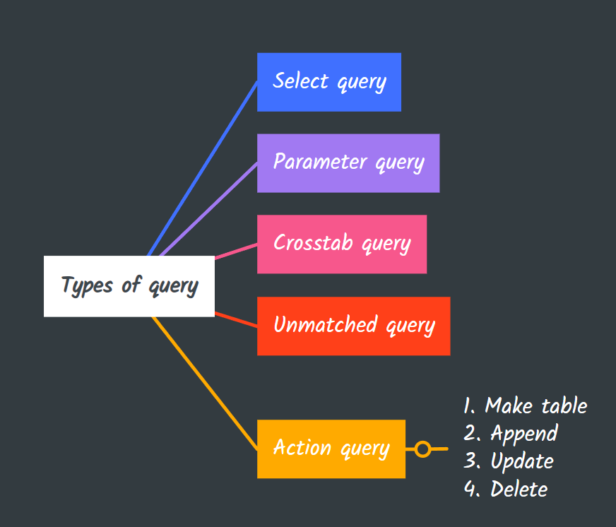
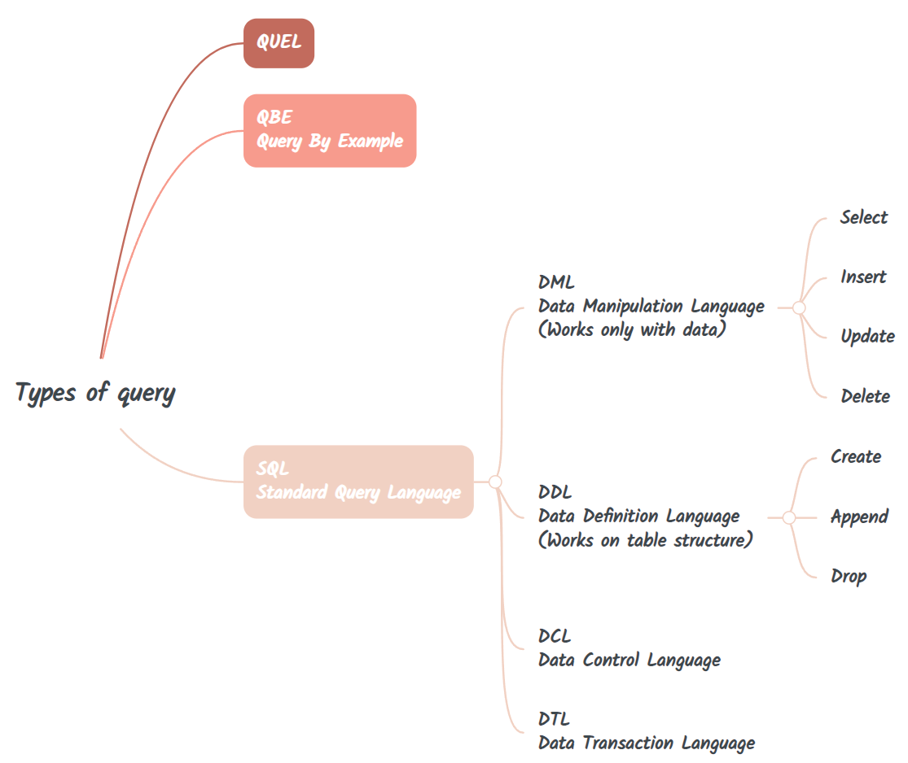

> ## ```Query, SQL```

Query or queries are some instructions made to a database software to find and retrieve particular data saved in the database.

## Types of queries:


## Query Language


## SQL vs MySQL
MySQL is a database whereas SQL is a language. MySQL uses SQL language to write the queries. 

## MySQL datatypes


## MySQL Queries

1. Creating a new database
```sql
CREATE DATABASE db_name;
```
**Caution**: if the database exists with the same name, it will throw an error. 

2. Use an existing database
```sql
USE db_name;
```

3. Table creation
```sql 
CREATE TABLE table_name;
```

4. Deleting an existing table
```sql
DROP TABLE table_name;
```

5. Assign a primary key: To uniquley identify a table we should always provide a primary key to any suitable field.
```sql
CREATE TABLE
    Students(
        Roll CHAR(4) PRIMARY KEY, -- 
        Name VARCHAR(50),
        Marks DOUBLE
    );
```

### **Duplicate values aren't allowed for primary key field.**
